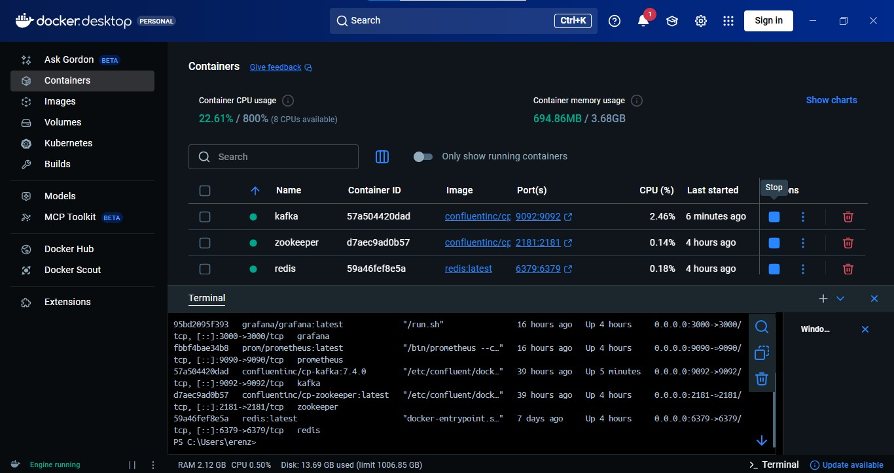
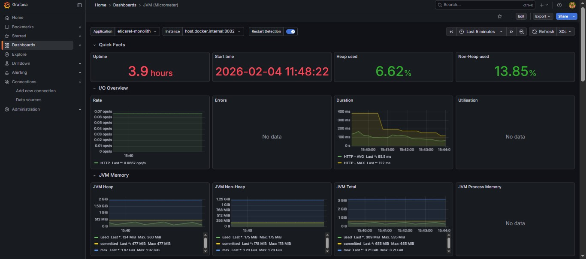

# TechHub - Scalable E-Commerce Ecosystem

TechHub, yüksek trafikli senaryolar düşünülerek tasarlanmış; Java Spring Boot (Backend) ve React/TypeScript (Frontend) mimarisi üzerine kurulu modern bir e-ticaret platformudur. Performans optimizasyonu için **Redis**, veri bütünlüğü için **PostgreSQL** ve Kafka, Redis, Zookeeper, Prometheus ve Grafana gibi altyapı bileşenlerinin izole, tutarlı ve kolay yönetilebilir şekilde çalıştırılması ve entegrasyonunun sağlanması amacıyla **Docker** kullanır.API dokümantasyonu ve test edilebilirlik için **Swagger (OpenAPI)** kullanılır
asenkron ve event-driven mimari için **Apache Kafka**, sistem metriklerinin toplanması için Prometheus, görselleştirilmesi için **Grafana** entegre edilmiştir.

---

## Teknolojik Donanım (Tech Stack)

### Backend (Microservice-Ready Monolith)

- **☕Java 17 & Spring Boot :** Güçlü tip güvenliği ve Spring Security
- **🐘PostgreSQL :** Kompleks ilişkisel veriler
- **⚡Redis Caching :** Ürün ve sepet işlemleri
- **📡Kafka Event Bus :** OrderCreatedEvent cascade flow
- **🧬Hibernate & JPA :** ORM kolaylığı
- **🛡️Resilience4j :** Circuit Breaker, Retry, RateLimiter
- **🧾iText PDF :** Fatura generation
- **🐳Docker & Docker Compose :** Portable ortam
- **🧩 Bağımlılık Yönetimi :** Gevşek bağlılık (Loose coupling) için Spring Dependency Injection.
- **🔐 JWT Destekli Koruma :** Stateless kimlik doğrulama ve Spring Security entegrasyonu.
- **📦 Veri Transferi (DTO) :** Entity katmanını izole eden, sadece gerekli veriyi taşıyan DTO (Data Transfer Object) kullanımı.
- **🔄 Veri Erişimi:** Hibernate & JPA ile optimize edilmiş ORM yönetimi.


### Frontend (Modern UI/UX)

- React & TypeScript: Component’lerin props ve state yapıları netleşir, olası hatalar daha yazım aşamasında yakalanır, büyük ve ekipli projelerde kodun okunabilirliği ve sürdürülebilirliği artar; güçlü IDE desteği sayesinde geliştirme ve refactor süreçleri hızlanır, bu da React uygulamalarının daha güvenli, ölçeklenebilir ve uzun ömürlü olmasını sağlar.
- Redux Toolkit: Redux Toolkit, state yönetimini daha az boilerplate kodla, daha okunabilir ve hataya daha az açık şekilde yapmak; immutable update, async işlemler ve best practice’leri hazır olarak sunarak Redux kullanımını basitleştirmek ve büyük ölçekli uygulamalarda sürdürülebilir bir yapı sağlamak için kullanıldı.
- Tailwind CSS: Tailwind CSS, hazır utility sınıfları sayesinde hızlı ve tutarlı arayüz geliştirmek, özel CSS yazımını minimize etmek, responsive tasarımı kolaylaştırmak ve büyük projelerde stil karmaşasını önleyerek bakım maliyetini düşürmek için kullanıldı.
- Axios:Axios, HTTP isteklerini merkezi ve yönetilebilir bir yapı üzerinden yapmak, interceptor’lar ile token, hata ve response yönetimini kolaylaştırmak ve async API iletişimini daha okunabilir ve güvenli hale getirmek için kullanıldı.

---

## Sistem Mimarisi - Saga Pattern

Sipariş oluşturulduğunda şu cascade flow gerçekleşir:

```
User Checkout
    ↓
Order Created (PAYMENT_CONFIRMED) ← Mock Ödeme
    ↓ [OrderCreatedEvent]
Payment Service ← PAID
    ↓ [PaymentSuccessEvent]
Stock Service ← STOCK_RESERVED
    ↓ [StockReservedEvent]
Shipment Service ← READY_FOR_SHIPMENT
    ↓
Admin Tarafı (SHIPPED, DELIVERED)
```

Hata durumunda CompensationService refund işlemi başlatır.

---

## Order Status Flow

| Status | Açıklama |
|--------|----------|
| AWAITING_PAYMENT | Siparış bekleniyor |
| PAYMENT_CONFIRMED | Ödeme onaylandı |
| STOCK_RESERVED | Stok ayrıldı |
| READY_FOR_SHIPMENT | Gönderime hazır |
| SHIPPED | Kargoya verildi |
| DELIVERED | Teslim edildi |
| CANCELLED | İptal edildi |

---

## Hızlı Başlangıç

### 1. Gereksinimler

- JDK 17+
- Node.js (v16+)
- Docker Desktop

### 2. Docker ile Altyapı Hazırlama ###
Docker altyapısını ve projeyi terminal üzerinden adım adım ayağa kaldırmak için şu komutları sırasıyla uygulayabilirsin. Görsellerdeki Docker Desktop verilerine dayanarak, sistemin doğru çalışması için şu akışı izlemeliyiz:

**1. Adım:** Docker Konteynerlarını Hazırlama ve Başlatma
Terminali proje ana dizininde (TechHub klasörü) aç ve şu komutu çalıştır:
```bash
docker-compose up -d
```
**2. Adım:**
Altyapının (PostgreSQL, Redis, Kafka) sorunsuz ayağa kalktığını doğrulamak için:
```bash
docker ps
```

---
**Açıklama:** Bu komut; paylaştığın görsellerde görülen zookeeper, redis, prometheus ve grafana servislerini arka planda (-d) başlatır.

### 3. 📊 İzlenebilirlik ve Monitoring (Grafana & Prometheus) ### 
Sistemin sağlığını, CPU kullanımını ve API performansını anlık olarak izlemek için Grafana ve Prometheus entegrasyonu yapılmıştır.

Grafana UI: http://localhost:9090/targets
Grafana UI: http://localhost:3000

Kullanıcı: admin
Şifre: admin (İlk girişte değiştirmeniz istenebilir)

Not: API performans grafiklerini ve JVM metriklerini görsel olarak buradan takip edebilirsiniz. Projenin sağlık durumunu izlemek için kullandığın Prometheus sisteminin "Target Health" (Hedef Sağlığı) ekranını gösteriyor. Kısacası, Prometheus'un Spring Boot uygulandan veri çekip çekemediğini buradan anlıyoruz.





**Services:**
- **PostgreSQL:** localhost:5432
- **Redis:** localhost:6379
- **Kafka:** localhost:9092

### 3. Backend Çalıştırma

```bash
cd backend
./mvnw spring-boot:run
```

**API:** http://localhost:8082

### 4. Frontend Çalıştırma

```bash
cd frontend
npm install
npm run dev
```

**UI:** http://localhost:5173

---

## API Endpoints

```
POST   /api/v1/auth/register              - Kayıt ol
POST   /api/v1/auth/login                 - Giriş yap
GET    /api/v1/products                   - Ürünleri listele
POST   /api/v1/orders                     - Sipariş oluştur (Saga başlatır)
GET    /api/v1/orders/{orderId}           - Sipariş detayı
GET    /api/v1/orders/{orderId}/invoice   - Fatura PDF indir
GET    /api/v1/orders                     - Kullanıcı siparişleri
PATCH  /api/v1/orders/{orderId}/ship      - Kargo gönder (Admin)
PATCH  /api/v1/orders/{orderId}/deliver   - Teslim et (Admin)
```
Product Controller API Listesi
---

## Proje Klasör Yapısı
**Backend**
```
├───main
│   ├───java
│   │   └───com
│   │       └───v1
│   │           └───backend
│   │               ├───config
│   │               ├───controller
│   │               ├───dto
│   │               │   ├───brand
│   │               │   ├───cart
│   │               │   ├───category
│   │               │   ├───login
│   │               │   ├───order
│   │               │   └───signup
│   │               ├───event
│   │               ├───exception
│   │               ├───kafka
│   │               ├───model
│   │               ├───repository
│   │               ├───security
│   │               ├───service
│   │               ├───utils
│   │               └───validation
│   └───resources
│       ├───static
│       │   └───uploads
│       │       ├───brands
│       │       ├───categories
│       │       └───products
│       └───templates
└───test
    └───java
        └───com
            └───v1
                └───backend
```
**Frontend**
---
```
├───app
├───assets
│   └───images
├───components
│   └───layout
├───features
│   ├───auth
│   ├───cart
│   └───order
├───hooks
├───pages
└───services
```
## Sipariş İş Akışı (Order Flow)

**1. User** → CheckoutPage (adres, telefon, ödeme yöntemi)
**2. Backend** → Order oluştur (AWAITING_PAYMENT)
**3. Mock Payment** → PAID (otomatik)
**4. Status** → PAYMENT_CONFIRMED
**5. Kafka Event** → OrderCreatedEvent yayınla
**6. Frontend** → /order-confirmation/{orderId}
**7. OrderConfirmationPage:**
   - Teslimat numarası (kopyala butonu)
   - Fatura PDF indirme butonu
   - Real-time timeline (6 stage progress)

---

## Fatura (Invoice) PDF İndirme

```
**GET /api/v1/orders/{orderId}/invoice**
**Response:** PDF file
**Filename:** ORD-xxxxx-Fatura.pdf
```

**PDF İçeriği:** 
- **Header:** TechHub Logo
- Fatura No ve Tarihi
- Müşteri Bilgileri
- Ürün Listesi
- Totals (Ara Toplam, Kargo, Vergi, Toplam)
- **Footer: ** Otomatik oluşturulmuş belge

---

## Kafka Event Topics

```
order-created               - OrderService → PaymentService
payment-success             - PaymentService → StockService
payment-failed              - PaymentService → Compensation
stock-reserved              - StockService → ShipmentService
stock-reservation-failed    - StockService → Compensation
order-cancelled             - Compensation → OrderService
```

---

## Güvenlik (Security)

- JWT Token: Stateless authentication
- BCrypt: Şifre encryption
- Authorization: Role-based access (USER, ADMIN)
- Protected Endpoints: /orders, /cart (JWT gerekli)
- Public Endpoints: /products, /categories

---

## Troubleshooting

### Docker Error
```bash
docker-compose logs postgres
docker-compose restart
```

### JWT Expired
Login yaparak yeni token al

### Kafka Consumer Lag
```bash
docker exec techhub-kafka kafka-consumer-groups.sh \
  --bootstrap-server localhost:9092 \
  --group order-service --describe
```

---

## Gelecek Roadmap

- [ ] Elasticsearch: Ultra hızlı ürün araması
- [ ] RabbitMQ: E-posta bildirimleri
- [ ] Stripe/Iyzico: Gerçek ödeme gateway
- [ ] WebSocket: Real-time tracking
- [ ] Kubernetes: Orkestrasyon

---

## İletişim

Email: erenzirekbilek@hotmail.com